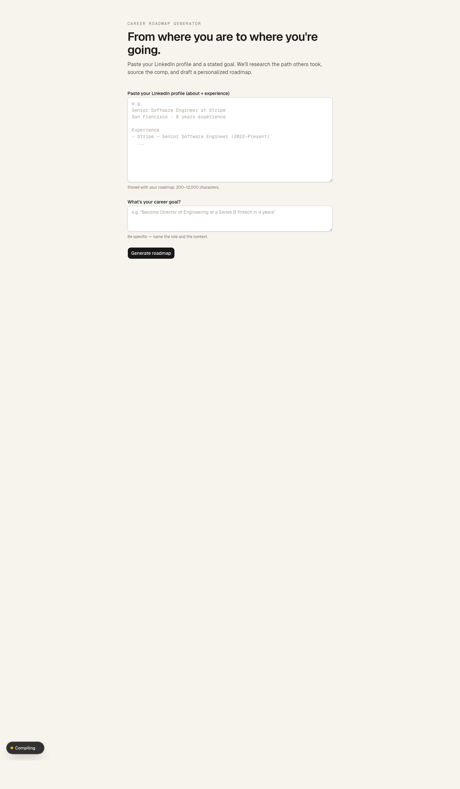
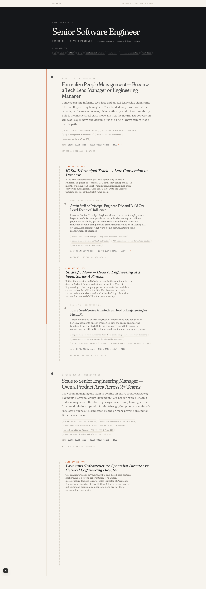
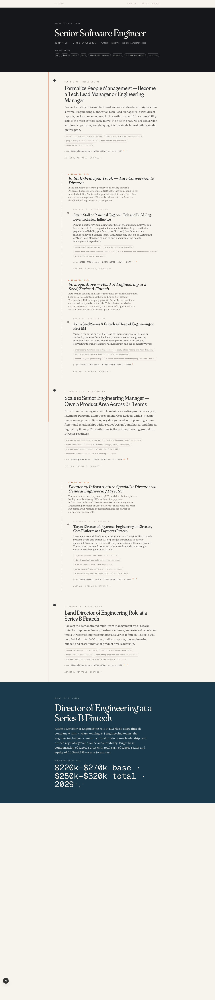

# Career Roadmap Generator

> Paste a LinkedIn profile + a career goal → get a research-backed, sourced, personalized career roadmap.

A working prototype. The pipeline is verified end-to-end; the visual design
is a work in progress and not the final aesthetic.

---

## What it does

You paste your LinkedIn profile text and a stated career goal
(e.g. *"Become a Director of Engineering at a Series B fintech in 4 years"*).
The app runs a 3-stage Claude pipeline and returns a personalized roadmap
with milestones, branching alternative paths, timeframes, comp bands, and
cited sources.



*The form. Paste a profile, state a goal, hit Generate.*

---

## The roadmap view

After generation, `/r/<slug>` renders an editorial, scroll-revealed roadmap
built around a vertical spine with milestones stacked down the left, and
branching "alternative paths" where Claude found a meaningful fork.



Each milestone card is collapsible; expanding one reveals concrete actions,
pitfalls, suggested roles, and the specific sources the claim is based on.
A terminal *goal* card at the bottom anchors the whole thing with the
researched compensation band.



---

## How it's built

**Stack**: Next.js 16 (App Router) · TypeScript · Tailwind v4 · shadcn/ui ·
Anthropic SDK · Neon Postgres · Framer Motion · `@react-pdf/renderer` (WIP).

**The pipeline** — three server-side stages, streamed to the client via SSE:

| Stage | Model | Tools | What it does |
|---|---|---|---|
| `parseProfile` | `claude-sonnet-4-6` | — | Normalizes the LinkedIn paste into structured `CurrentState` + `NormalizedGoal` JSON. Classifies the goal as clear / vague / impossible. |
| `research` | `claude-sonnet-4-6` + extended thinking | `web_search_20260209` | Gathers evidence on typical paths, skills gaps, comp bands, pivots, certs, and pitfalls. Every comp number must cite a URL. |
| `synthesize` | `claude-sonnet-4-6` | forced tool call `emit_roadmap` | Shapes the research into a strict `Roadmap` JSON that the viz consumes. |

Each stage streams progress events (`stage_started`, `stage_progress`,
`stage_completed`, `error`, `roadmap_ready`) back to the browser. Postgres
stores a checkpoint after research so a Stage 3 failure is resumable without
re-paying for research.

**Types & schema** live in [`src/lib/roadmap/types.ts`](./src/lib/roadmap/types.ts)
and [`src/lib/roadmap/schema.ts`](./src/lib/roadmap/schema.ts). A Zod `superRefine`
guarantees every cited `source_id` resolves against the `sources[]` array.

**The visualization** is a bespoke SVG spine + Framer Motion reveal anims +
DOM cards — not React Flow. Reason: React Flow is built for editor-like
canvases (drag / zoom / pan), and the roadmap is a long-form scrollable
document, not a graph editor.

---

## Status

| Phase | Status |
|---|---|
| 0 · SDK probe verification | ✅ Verified live against Claude Sonnet 4.6 |
| 1 · Vertical slice (form → SSE pipeline → raw JSON view) | ✅ Builds, streams, persists |
| 2 · Visualization spike (MilestoneCard, Spine, GoalCard, branches, citations) | ✅ Builds, renders fixture |
| 3 · Branches, scroll-reveal, source hover cards | ✅ In the preview |
| 4 · Streaming UX — partial states during generation | ⏳ Not started |
| 5 · PDF export via `@react-pdf/renderer` | ⏳ Not started |
| 6 · Mobile, polish, launch | ⏳ Not started |

**Honest known issues:**

- The editorial design isn't landing yet. The visual direction ("Stripe docs
  meets Linear") needs another pass — current output reads a bit like an
  academic paper.
- Observed cost is ~$0.60–$0.70 per roadmap (Sonnet 4.6 + web search +
  extended thinking), higher than the planned $0.38. Stage 2 wall clock is
  ~3 min, Stage 3 adds another ~4 min on bad runs — above Vercel Pro's
  300s function ceiling. Prompts need tightening before launch.
- The fixture Claude produced only has 3 primary milestones for a 4-year
  plan; feels thin. Prompt needs to push for 5–7.

---

## Run locally

Requirements: Node 20+, pnpm, an `ANTHROPIC_API_KEY`, and a free
[Neon](https://neon.tech) Postgres connection string.

```bash
# 1. Clone and install
git clone https://github.com/rdsciv/career-roadmap.git
cd career-roadmap
pnpm install

# 2. Env
cp .env.example .env.local
# Fill in ANTHROPIC_API_KEY and DATABASE_URL

# 3. Apply migrations
pnpm migrate

# 4. Run
pnpm dev
# → http://localhost:3000
```

**Useful scripts:**

| Command | Purpose |
|---|---|
| `pnpm dev` | Next dev server |
| `pnpm build` | Production build |
| `pnpm typecheck` | `tsc --noEmit` |
| `pnpm probe` | Run the Phase 0 SDK probe against the live API (~$0.50/run) |
| `pnpm tsx scripts/probe-synthesis.ts` | Regenerate the fixture roadmap |
| `pnpm migrate` | Apply SQL migrations to `DATABASE_URL` |

No Postgres? Visit `/preview` instead of `/`. It renders the fixture
roadmap at [`src/lib/roadmap/__fixtures__/roadmap.fixture.ts`](./src/lib/roadmap/__fixtures__/roadmap.fixture.ts)
so you can see the visualization without any backing services.

---

## Directory map

```
src/
├── app/
│   ├── page.tsx                         landing + form
│   ├── preview/page.tsx                 renders the fixture roadmap (no DB needed)
│   ├── api/generate/route.ts            SSE Route Handler driving the 3-stage pipeline
│   └── r/[slug]/page.tsx                view a generated roadmap
├── components/
│   ├── form/GenerateForm.tsx            client form with SSE consumption
│   ├── roadmap/
│   │   ├── RoadmapView.tsx              top-level composition
│   │   ├── spine/Spine.tsx              scroll-driven SVG spine
│   │   ├── nodes/{Milestone,Goal,CurrentState,Branch}Card.tsx
│   │   ├── primitives/{TimeframePill,SkillChip,CompBand…}.tsx
│   │   └── citations/{SourceContext,Bibliography}.tsx
│   └── ui/                              shadcn primitives
└── lib/
    ├── anthropic/client.ts              singleton SDK client + model constants
    ├── pipeline/
    │   ├── prompts.ts                   system + user prompts per stage
    │   ├── tools.ts                     Anthropic tool definitions (emit_*)
    │   ├── stages.ts                    parseProfile / research / synthesize
    │   └── stream.ts                    SSE writer + event type union
    ├── roadmap/
    │   ├── types.ts                     Roadmap, Milestone, Source, Branch
    │   ├── schema.ts                    Zod schema → also feeds tool input_schema
    │   ├── format.ts                    pure formatters shared web ↔ pdf
    │   └── tokens.ts                    design tokens shared web ↔ pdf
    └── db/
        ├── client.ts                    Neon HTTP client singleton
        ├── roadmaps.ts                  CRUD with checkpoint semantics
        └── migrations/0001_initial.sql  schema
```

---

## License

Prototype, no license yet — don't deploy this as a product.
